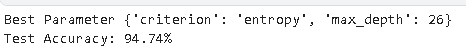
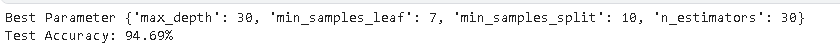
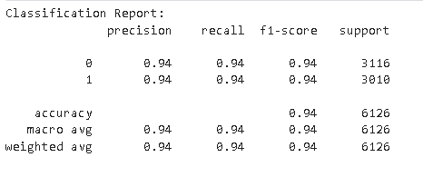
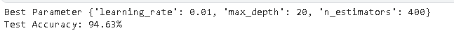
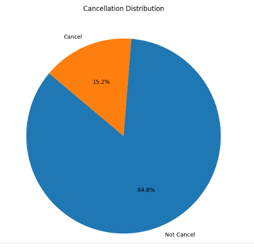

# Travel Ticket Cancellation Prediction using Machine Learning for Risk_Management

## Project Overview

The objective of this Project is to develop a model that accurately predicts whether users will cancel their tickets. Each cancellation incurs a fine for the ticket registration site from the passenger company. Therefore, it is crucial to identify tickets that are likely to be canceled, enabling effective risk management within the company. By utilizing the available data, we will train a model to accurately detect trip cancellations.

## Dataset

The dataset used for this project contains information about passengers who have registered for a journey via a travel booking website. It includes features such as departure time, reservation status, passenger demographics, ticket price, and cancellation status.

## Methodology

1. **Data Acquisition:** Collected relevant flight data from the provided dataset.
2. **Data Preprocessing:**
   * **Missing Values:** A total of 340,703 missing values were dealt with across the dataset. The `HashPassportNumber_p` column, having the most missing values (100155), was 
     dropped as it was unnecessary for the prediction task. Missing values in other columns were addressed using appropriate imputation techniques or by removing the     
     rows/columns.
   * **Outlier Handling:** Outliers in the `Price` and `CouponDiscount` columns were identified and addressed by removing invalid negative values and replacing '-' symbols 
     with empty strings. Rows with a price of 0 were also removed.
   * **Data Type Conversion:** Data types of specific columns like `Price` and `CouponDiscount` were changed from 'float' to 'int' for better handling.
   * **One-Hot Encoding:** Categorical variables such as `Vehicle` and `ReserveStatus` were converted into numerical representations using one-hot encoding.
   * **Undersampling:** The target variable `Cancel` had a class imbalance, with a higher proportion of non-cancellations. Undersampling was applied to balance the dataset, resulting in 15315 samples for each class.
3. **Model Selection:** Chose appropriate machine learning algorithms for classification, including Decision Tree, Random Forest, KNN, and XGBClassifier.
4. **Model Training:** Trained the selected models on the prepared dataset, utilizing training techniques and hyperparameter tuning.
5. **Model Evaluation:** 
    * Evaluated the performance of the trained models using metrics like accuracy, precision, recall, and F1-score.
    * **Decision Tree Accuracy:**   (After Hyperparameter Tuning)

        
    * **Random Forest Accuracy:**   (After Hyperparameter Tuning)

      
    * **KNN Accuracy:**

      
    * **XGBoost Accuracy:**    (After Hyperparameter Tuning)

      

## Exploratory Data Analysis (EDA)

* **Cancellation Distribution:** A pie chart was created to visualize the overall cancellation rate, showing that about 15.3% of tickets were canceled.
  <!-- Placeholder for Cancellation Distribution Pie Chart -->
   

* **Most Departure and Destination Cities:** Bar plots were used to identify the top 10 departure and destination cities for non-canceled tickets.
* <!-- Placeholder for Cancellation Distribution Pie Chart -->
        [Screenshot of cancellation distribution pie chart will be added here]
* **Monthly Income:** Line plots were used to display the monthly income with and without considering cancellations, revealing the financial impact of cancellations.
* <!-- Placeholder for Cancellation Distribution Pie Chart -->
        [Screenshot of cancellation distribution pie chart will be added here]
* **Trip Reason and Cancellation:** A count plot was used to analyze the relationship between trip reasons and cancellations.
* <!-- Placeholder for Cancellation Distribution Pie Chart -->
        [Screenshot of cancellation distribution pie chart will be added here]
* **Vehicle and Trip Reason:** A count plot was used to analyze the relationship between vehicle types and trip reasons.
* <!-- Placeholder for Cancellation Distribution Pie Chart -->
        [Screenshot of cancellation distribution pie chart will be added here]

## Results

* All models achieved high accuracy in predicting flight cancellations (around 94%).
* Random Forest achieved the highest test accuracy (94.52%) after hyperparameter tuning.

## Conclusion

This project successfully demonstrates a robust approach to building a machine learning model for flight cancellation prediction. The findings contribute to a better understanding of factors influencing cancellations, enabling airlines to potentially improve their operations and reduce losses.

## Requirements

* Python 3.11
* Pandas
* NumPy
* Scikit-learn
* XGBoost
* Imbalanced-learn
* Seaborn
* Matplotlib
